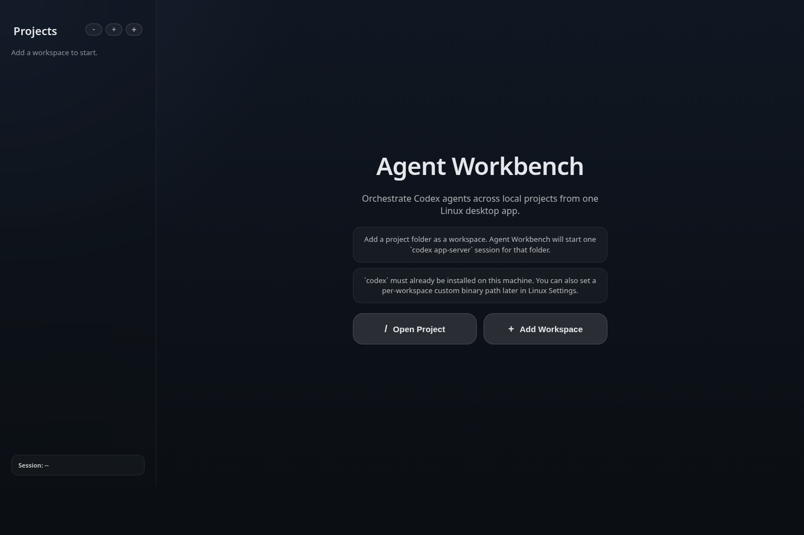

# Agent Workbench

Agent Workbench is a Tauri app for managing local workspaces and long-running engineering sessions on Ubuntu Linux. It provides a sidebar to manage projects, a home screen for quick actions, and a conversation view backed by an app-server protocol.

This build currently targets Wayland-first Linux desktops, with X11 as a compatibility fallback through the normal GTK/WebKit stack.
Distribution is Debian-package only for now.



## Features

- Add and persist workspaces using the system folder picker.
- Spawn one app-server process per workspace and stream events over JSON-RPC.
- Restore threads per workspace from local history (`thread/list`) and resume on selection.
- Start threads, send messages, show reasoning/tool call items, and handle approvals.
- Per-workspace defaults and per-thread overrides for model, reasoning effort, speed mode, access mode, and custom binary path.
- Search, rename, pin, and archive threads from the sidebar.
- Review presets, thread checkpoints, and lightweight keyboard shortcuts for common actions.
- Inline alerts, disconnect recovery state, and a resizable sidebar for denser workspaces.
- Skills menu that inserts `$skill` tokens into the composer.
- Standard desktop window shell suitable for Linux desktop use.

## Status

Current public-release validation in this repository:

- `npm test`
- `npm run build`
- `cargo test --lib`
- `cargo clippy --lib -- -D warnings`
- `npm audit --audit-level=moderate`
- `cargo audit --quiet`
- `npm run smoke:app-server`
- `npm run build:deb`
- `npm run release:checksums`

`cargo audit --quiet` currently reports warning advisories in transitive Tauri/GTK dependencies. They are tracked in [docs/SECURITY-REVIEW.md](docs/SECURITY-REVIEW.md) and are not direct application code.

## Requirements

- Node.js + npm
- Rust toolchain (stable)
- A compatible local CLI installed on your system. The current backend defaults to `codex` in `PATH`.
- Linux desktop libraries required by Tauri/WebKitGTK

If the default binary is not in `PATH`, set a custom absolute binary path per workspace from `Linux Settings`.

Typical Ubuntu package set:

```bash
sudo apt install libwebkit2gtk-4.1-dev libgtk-3-dev libsoup-3.0-dev \
  libayatana-appindicator3-dev librsvg2-dev patchelf
```

## Getting Started

Install dependencies:

```bash
npm install
```

Run frontend validation tests:

```bash
npm test
```

Run in dev mode:

```bash
npm run tauri dev
```

Preview the static UI shell in a browser:

```bash
npm run dev
```

The browser preview cannot connect workspaces or run sessions; those actions require the Tauri desktop runtime. It is useful for checking layout and capturing screenshots.

Build the Ubuntu/Debian package:

```bash
npm run build:deb
```

Write SHA-256 checksums for the generated Debian artifacts:

```bash
npm run release:checksums
```

Verify the app-server handshake independently:

```bash
npm run smoke:app-server
```

Run backend validation tests:

```bash
cd src-tauri
cargo test --lib
cargo clippy --lib -- -D warnings
```

## Project Structure

```
src/
  components/       UI building blocks
  hooks/            state + event wiring
  services/         Tauri IPC wrapper
  styles/           split CSS by area
  types.ts          shared types
src-tauri/
  src/lib.rs        Tauri backend + app-server client
  tauri.conf.json   window configuration
```

## Linux Notes

- Workspaces persist to `workspaces.json` under the app data directory.
- Threads are restored by filtering `thread/list` results using the workspace `cwd`.
- Selecting a thread always calls `thread/resume` to refresh messages from disk.
- CLI sessions appear if their `cwd` matches the workspace path; they are not live-streamed unless resumed.
- Each workspace launches its own app-server process with that workspace as the child process working directory.
- Each workspace can store its own default access mode, speed mode, default model, default reasoning effort, and optional custom binary path.
- Last active workspace and thread restore on relaunch, and per-thread overrides/checkpoints persist in local storage.
- The current app-server integration uses `codex app-server` over stdio; see `src-tauri/src/lib.rs`.
- Release builds currently produce a `.deb` package only.
- Release checksum manifests are written next to the `.deb` as `SHA256SUMS`.

## Project Docs

- Security review: [docs/SECURITY-REVIEW.md](docs/SECURITY-REVIEW.md)
- Smoke-test checklist: [docs/SMOKE-TEST-CHECKLIST.md](docs/SMOKE-TEST-CHECKLIST.md)

## Security Model

- Agent Workbench is a local desktop shell around a configured `codex app-server` process.
- Workspace paths and custom binary paths are stored locally in the app data directory.
- Custom binaries must be absolute executable files and should only point to trusted local tools.
- Debug and health diagnostics are redacted on a best-effort basis before display or copy.
- Approval prompts remain enabled even when a workspace uses full-access mode.
- Release artifacts are checksummed with SHA-256, but not signed yet.

Please report security-sensitive issues privately if possible. See [SECURITY.md](SECURITY.md).

## Troubleshooting

- `workspace not connected`
  Reconnect the workspace from the sidebar or `Linux Settings`. The app now marks workspaces disconnected when the underlying app-server session exits.

- Custom binary fails to save
  Custom binaries must be absolute file paths. Leave the field blank to use the default binary from `PATH`.

- Custom binary saves but reconnect fails
  Confirm the selected file is executable and actually launches the expected app-server command. The workspace settings panel will show validation failures inline, and the main UI will show reconnect errors.

- Threads do not appear after adding a workspace
  Confirm the workspace connected successfully and that local thread history exists in that folder. Use the workspace refresh action to reload `thread/list`.

- Approval requests are missing
  Approval prompts only appear when the app-server emits a request. If a turn stalls, open the debug panel and inspect the latest stderr/error events.

- Packaging works locally but not on another machine
  Verify the target Ubuntu machine has the required WebKitGTK and GTK dependencies listed above before installing the `.deb`.
